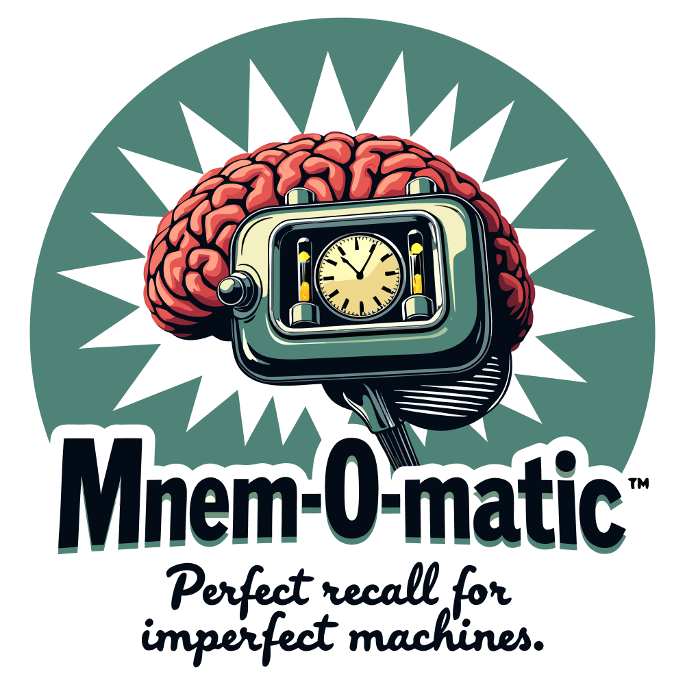

# Mnem-O-matic

*Perfect recall for imperfect machines.*

Shared memory layer for LLMs. Store documents, knowledge and notes in a single portable database and access them from any MCP-compatible client — Claude Code, VS Code Copilot, ChatGPT, Mistral Vibe, custom agents, or anything that speaks MCP.

Runs privately in a Docker container or natively. Your data never leaves your machine.

## The Problem

Every LLM session starts from scratch. Claude doesn't know what ChatGPT learned yesterday. Your Copilot session can't access the architectural decisions you discussed with Claude last week. Each tool operates in complete isolation.

Mnem-O-matic fixes this by providing a shared, persistent memory that any LLM can read from and write to.

## What It Stores

**Documents** — reference material, code snippets, specs, configs, notes. Anything you want LLMs to have access to.

**Knowledge** — discrete facts, decisions, and observations. "The auth system uses JWT with RS256." "We chose Postgres over SQLite for the main database." "The deploy pipeline runs on GitHub Actions."

**Notes** — quick thoughts, ideas, observations, and voice transcripts. Informal content that LLMs should be aware of but that isn't structured enough to be a document or atomic enough to be a knowledge entry.

All types support namespaces (per-project or global), tags, and metadata. Everything is searchable via full-text and semantic search.

## Documentation

- [Installation Guide](docs/installation.md) — prerequisites, Docker profiles, TLS setup, configuration, development
- [Usage Guide](docs/usage.md) — connecting clients, authentication, tools, search, resources
- [Tech Stack](docs/tech-stack.md) — architecture decisions, embeddings, concurrency, performance

## License

[Apache License 2.0](LICENSE)
