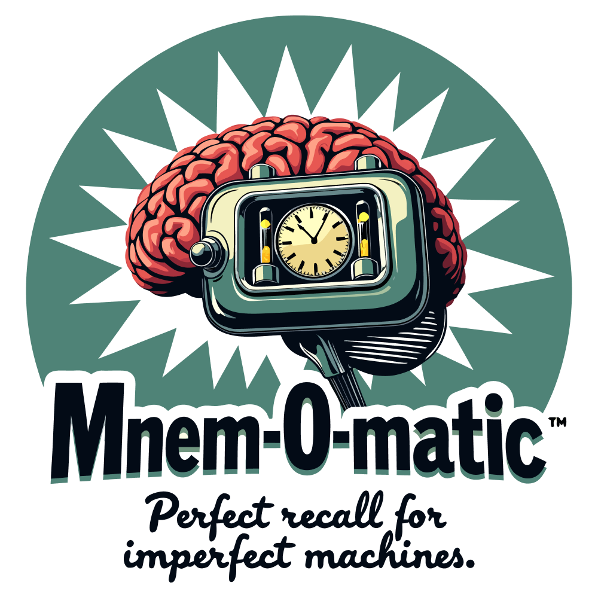
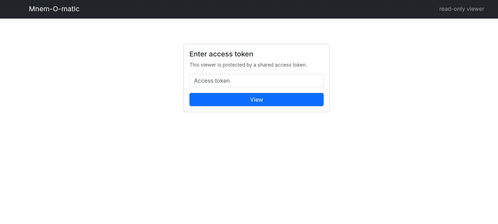
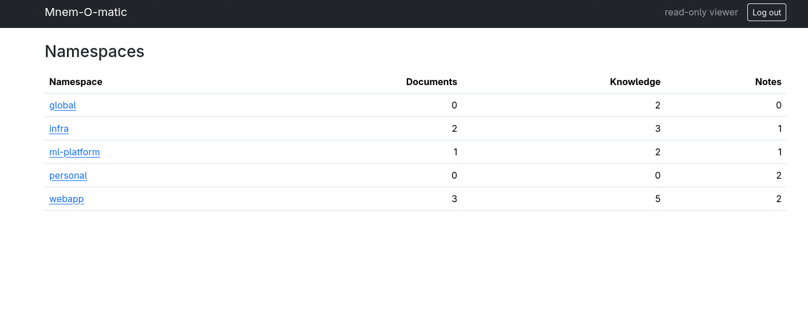
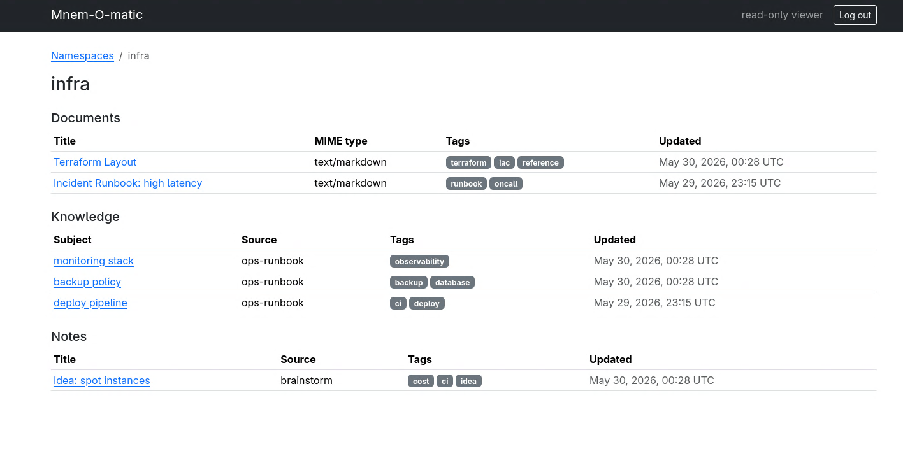
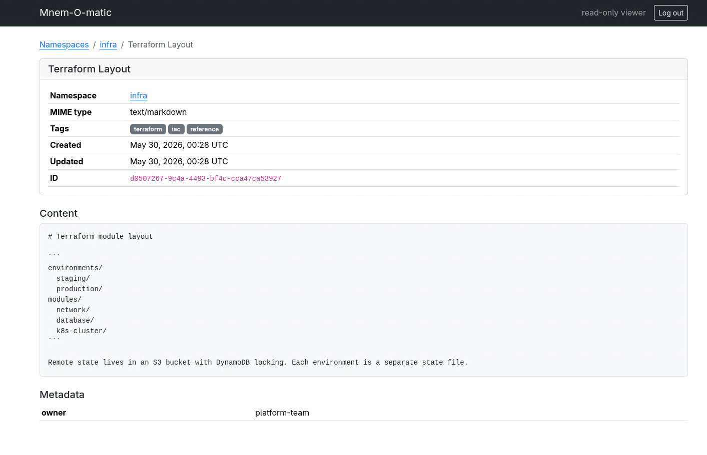

<div align="center">


[](https://github.com/integratedcomputersolutions/mnem-o-matic/actions/workflows/ci.yml)
[](LICENSE)
[](https://www.python.org/)
[](https://github.com/integratedcomputersolutions/mnem-o-matic/pkgs/container/mnem-o-matic)

</div>

Shared memory layer for LLMs. Store documents, knowledge and notes in a single portable database and access them from any MCP-compatible client — Claude Code, VS Code Copilot, ChatGPT, Mistral Vibe, custom agents, or anything that speaks MCP.

Runs privately in a Docker container or natively. Your data never leaves your machine.

## The Problem

Every LLM session starts from scratch. Claude doesn't know what ChatGPT learned yesterday. Your Copilot session can't access the architectural decisions you discussed with Claude last week. Each tool operates in complete isolation.

Mnem-O-matic fixes this by providing a shared, persistent memory that any LLM can read from and write to.

## What It Stores

**Documents** — reference material, code snippets, specs, configs, notes. Anything you want LLMs to have access to.

**Knowledge** — discrete facts, decisions, and observations. "The auth system uses JWT with RS256." "We chose Postgres over SQLite for the main database." "The deploy pipeline runs on GitHub Actions."

**Notes** — quick thoughts, ideas, observations, and voice transcripts. Informal content that LLMs should be aware of but that isn't structured enough to be a document or atomic enough to be a knowledge entry.

All types support namespaces (per-project or global), tags, and metadata. Everything is searchable via full-text and semantic search. Large documents are automatically split into chunks at store time, so search returns the most relevant passage rather than the entire file — giving agents focused context without burning their context window.

## Agent Skill

A sample agent skill file is included at `skills/mnemomatic/SKILL.md`. It teaches an agent how to use Mnem-O-matic effectively — when to search, which search mode to pick, what content type to store, and how to retrieve full content after a search.

The skill is written for Claude Code but can be adapted to any agent framework that supports custom instructions or skill files. Tailor the wording, triggers, and examples to match your agent's terminology and workflow.

To install for Claude Code:

```bash
# Personal (available in all your projects)
mkdir -p ~/.claude/skills && cp -r skills/mnemomatic ~/.claude/skills/mnemomatic

# Project-only (available in the current project)
mkdir -p .claude/skills && cp -r skills/mnemomatic .claude/skills/mnemomatic
```

## Web Viewer

A built-in, read-only web viewer lets you browse stored documents, knowledge, and notes in the browser — no MCP client required. It's view-only: no creating, editing, or deleting.

<div align="center">
<table>
<tr>
<td align="center"><a href="assets/mnemomatic-ui-login.png"></a><br><sub>Shared-secret login</sub></td>
<td align="center"><a href="assets/mnemomatic-ui-namespaces.png"></a><br><sub>Namespaces</sub></td>
</tr>
<tr>
<td align="center"><a href="assets/mnemomatic-ui-content.png"></a><br><sub>Browsing a namespace</sub></td>
<td align="center"><a href="assets/mnemomatic-ui-content-details.png"></a><br><sub>Item detail</sub></td>
</tr>
</table>
<sub><i>Click any image to view full size.</i></sub>
</div>

The viewer is disabled by default. Set a shared secret to enable it:

```bash
docker run -e MNEMOMATIC_UI_TOKEN=your-viewer-secret ...
```

Then open `http://your-host:8000/ui` and enter the token once. There are no user accounts — access is a single shared secret, kept separate from the MCP API key. When `MNEMOMATIC_UI_TOKEN` is unset, `/ui` is not served at all.

See the [Usage Guide](docs/usage.md#web-viewer) for details and security notes.

## Documentation

- [Installation Guide](docs/installation.md) — prerequisites, Docker profiles, TLS setup, configuration, development
- [Usage Guide](docs/usage.md) — connecting clients, authentication, tools, search, resources, web viewer
- [Tech Stack](docs/tech-stack.md) — architecture decisions, embeddings, concurrency, performance

## License

[Apache License 2.0](LICENSE)
