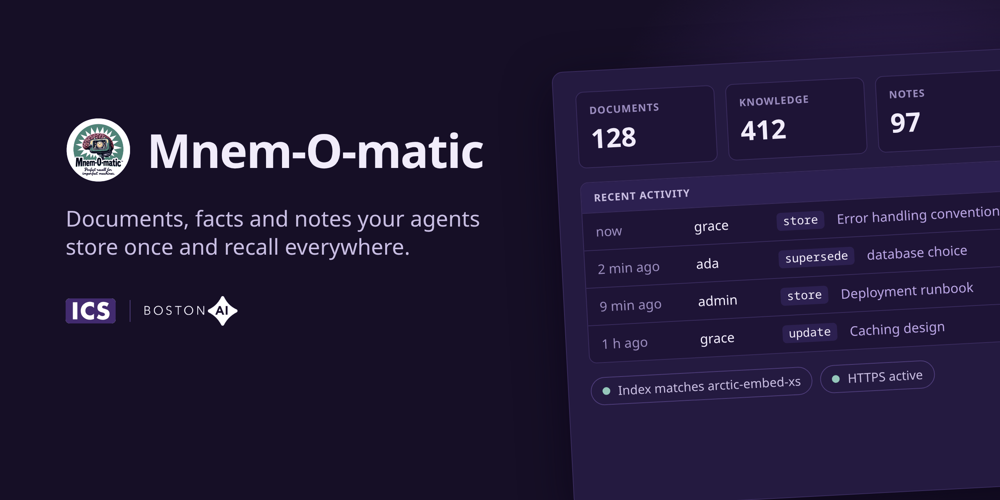

<div align="center">


[](https://github.com/integratedcomputersolutions/mnem-o-matic/actions/workflows/ci.yml)
[](LICENSE)
[](https://www.python.org/)
[](https://github.com/integratedcomputersolutions/mnem-o-matic/pkgs/container/mnem-o-matic)

</div>

Shared memory layer for LLMs. Store documents, knowledge and notes in a single portable database and access them from any MCP-compatible client — Claude Code, VS Code Copilot, ChatGPT, Mistral Vibe, custom agents, or anything that speaks MCP.

Runs privately in a Docker container or natively. Your data never leaves your machine.

## The Problem

Every LLM session starts from scratch. Claude doesn't know what ChatGPT learned yesterday. Your Copilot session can't access the architectural decisions you discussed with Claude last week. Each tool operates in complete isolation.

Mnem-O-matic fixes this by providing a shared, persistent memory that any LLM can read from and write to.

## What It Stores

**Documents** — reference material, code snippets, specs, configs, notes. Anything you want LLMs to have access to.

**Knowledge** — discrete facts, decisions, and observations. "The auth system uses JWT with RS256." "We chose Postgres over SQLite for the main database." "The deploy pipeline runs on GitHub Actions."

**Notes** — quick thoughts, ideas, observations, and voice transcripts. Informal content that LLMs should be aware of but that isn't structured enough to be a document or atomic enough to be a knowledge entry.

All types support namespaces (per-project or global), tags, and metadata. Everything is searchable via full-text and semantic search, narrowed when you need it by tag or by "updated since". Large documents are automatically split into chunks at store time, so search returns the most relevant passage rather than the entire file — giving agents focused context without burning their context window.

## A Memory and a Filing Cabinet

The filing cabinet is the part above — organized, tagged, searchable storage. What makes it also a *memory* is how content behaves over time: it has history, mistakes are reversible, and the store helps keep itself tidy:

- **Temporal facts** — knowledge answers questions whose answers change. When a fact changes, the old entry is superseded rather than overwritten: search returns only the current answer, and `fact_history` shows what was believed before, and until when. [More →](docs/usage.md#temporal-facts)
- **Undo & recovery** — every update and delete first saves the item's prior state as a revision; `restore` rolls back a bad edit or recreates a deleted item under its original id. [More →](docs/usage.md#usage-tracking--revisions)
- **Duplicate awareness & consolidation** — storing near-identical content gets flagged in the store response, and `consolidation_report` clusters look-alike items and lists stale, never-retrieved ones. The bundled `consolidate` and `briefing` prompts turn review into one-command workflows — no server-side LLM involved, the connected agent is the judge. [More →](docs/usage.md#memory-hygiene-duplicates-consolidation-prompts)
- **Associative recall** — `related` returns an item's nearest neighbors across all content types, so an agent that just read one thing can pull in the surrounding context it didn't know to search for. [More →](docs/usage.md#related-items)
- **Usage tracking** — items carry retrieval counters, bumped only when something is genuinely read or surfaced by search. The raw material for spotting what earns its place. [More →](docs/usage.md#usage-tracking--revisions)
- **Audit trail** — every write lands in an append-only log: what changed, when, by which user and token, from which client and address. Sign-ins, token and user changes are recorded too. Two-year retention by default. [More →](docs/usage.md#audit-log)

## Backups & Export

The whole store downloads as a **human-readable zip** — one folder per namespace, one Markdown file per item, metadata in sidecars — via `GET /export`, the web UI, or the CLI. Your memory stays portable and is never locked in. The server can also write that archive on a schedule with rotation: set `MNEMOMATIC_BACKUP_DIR` and backups happen with no host-side cron. [More →](docs/usage.md#export)

## Embedding Model

Semantic search runs on a local embedding model bundled into the Docker image — nothing leaves your machine. Four models are selectable at build time via the `EMBED_MODEL` build argument: **arctic-embed-xs** (the default) is the smallest and fastest, English only, at ~240 MB of memory; **amaretto-embed-148m** is a distillation of EmbeddingGemma that keeps most of its retrieval quality at roughly 40% of the memory, across 8 Latin-script languages plus code; **gte-multilingual-base** adds strong multilingual retrieval at near-arctic query speed; **EmbeddingGemma** has the best retrieval quality of the four — it resolves paraphrased queries that share no words with the stored content — at a higher CPU and memory cost. You can also bypass the built-in model and point `MNEMOMATIC_EMBED_URL` at any OpenAI-compatible embedding endpoint. See [choosing the built-in embedding model](docs/installation.md#choosing-the-built-in-embedding-model) for the full comparison.

**Changing your mind is safe.** The database records which model built its vector index, down to the task prefixes. Searching a new model's queries against an old model's vectors returns quietly wrong results — no error, just worse answers — so the server refuses to start on a mismatch and names what changed. Set `MNEMOMATIC_REINDEX=auto` and it re-embeds everything itself when the model changes, then stays out of the way on every later start. [More →](docs/installation.md#switching-embedding-models)

## Agent Skill

A sample agent skill file is included at `skills/mnemomatic/SKILL.md`. It teaches an agent how to use Mnem-O-matic effectively — when to reach for memory at all, which search mode to pick, what content type to store, how facts supersede, and how to undo mistakes.

The skill is written for Claude Code but can be adapted to any agent framework that supports custom instructions or skill files. Tailor the wording, triggers, and examples to match your agent's terminology and workflow.

To install for Claude Code:

```bash
# Personal (available in all your projects)
mkdir -p ~/.claude/skills && cp -r skills/mnemomatic ~/.claude/skills/mnemomatic

# Project-only (available in the current project)
mkdir -p .claude/skills && cp -r skills/mnemomatic .claude/skills/mnemomatic
```

## Web UI

The server ships its own web interface — sign in, browse everything the agents have stored, search it, follow the activity trail, mint API tokens for your agents, and get copy-ready connection instructions for each client. Administrators manage users and turn on HTTPS. Stored content stays **read-only** in the browser: only agents write, through MCP.

<div align="center">
<table>
<tr>
<td align="center"><a href="assets/mnemomatic-ui-login.png"></a><br><sub>Sign in</sub></td>
<td align="center"><a href="assets/mnemomatic-ui-dashboard.png"></a><br><sub>Dashboard</sub></td>
</tr>
<tr>
<td align="center"><a href="assets/mnemomatic-ui-item.png"></a><br><sub>Item detail</sub></td>
<td align="center"><a href="assets/mnemomatic-ui-search.png"></a><br><sub>Search</sub></td>
</tr>
<tr>
<td align="center"><a href="assets/mnemomatic-ui-connect.png"></a><br><sub>Connect an agent</sub></td>
<td align="center"><a href="assets/mnemomatic-ui-activity.png"></a><br><sub>Activity</sub></td>
</tr>
</table>
<sub><i>Click any image to view full size.</i></sub>
</div>

**People, not a shared key.** Each person signs in with a password and creates their own API tokens — one per agent or machine. Every MCP request is attributed to the token's owner, so the audit log names who did what, and revoking one token stops one agent. Two roles: administrators manage users and HTTPS; everyone else manages their own tokens. There is no per-user data separation — the store is shared, which is the point.

**HTTPS out of the box.** An administrator types the server's hostname; the server mints a private certificate authority bound to that one name and starts serving HTTPS. Trust the CA once per device (the setup page has the steps for each OS and for Node and Python tools), confirm from the browser, and plain HTTP steps aside. Your own certificate, or your own reverse proxy, work too. [More →](docs/installation.md#https)

See the [Usage Guide](docs/usage.md#web-ui) for details.

## Running It

```bash
docker run -d --name mnemomatic -p 8000:8000 -p 8443:8443 -v "$(pwd)/data:/data" \
  ghcr.io/integratedcomputersolutions/mnem-o-matic:latest-full
docker logs mnemomatic          # prints a one-time setup code
```

Open `http://your-host:8000`, enter the code, and you have an administrator account. (Ports taken on your host? See [If 8000 or 8443 is already taken](docs/installation.md#if-8000-or-8443-is-already-taken) — the HTTPS port must move together with `MNEMOMATIC_HTTPS_PORT`.) From there: create a token under **My tokens**, paste it into your client with the snippets on **Connect an agent**, and enable HTTPS under **Admin → HTTPS**.

Both Docker images run as an unprivileged user (uid 65532) — nothing in the server needs root. `GET /health` reports liveness without credentials, and the images ship a `HEALTHCHECK` that polls it, so `docker compose up --wait` and orchestrator readiness gates work with no configuration. Everything else requires a signed-in user or a token.

The database records which embedding model built its vector index, so swapping models cannot silently corrupt search: the server refuses to start on a mismatch and names what changed, and `MNEMOMATIC_REINDEX=auto` re-embeds once and then stays inert. The `embedding_info` tool reports the same state to an agent. [More →](docs/installation.md#switching-embedding-models)

## Documentation

- [Installation Guide](docs/installation.md) — prerequisites, Docker profiles, HTTPS, configuration, development
- [Upgrading from v2.x to v3.0](docs/installation.md#upgrading-from-v2x-to-v30) — the shared API key and viewer token are replaced by users and personal tokens
- [Usage Guide](docs/usage.md) — connecting clients, users and tokens, tools, search, resources, web UI
- [Tech Stack](docs/tech-stack.md) — architecture decisions, embeddings, concurrency, performance

## License

[Apache License 2.0](LICENSE)
