# Usage

## Connecting LLM Clients

The quickest path is the **Connect an agent** page in the web UI: it shows this server's URLs and a copy-ready configuration for each client, filled in with a token you just created. What follows is the same information in text form.

Every client needs two things — the MCP endpoint and a personal API token, sent as `Authorization: Bearer mnm_…`. Tokens are created per person under **My tokens**; make one per agent or machine so you can revoke them individually.

### Claude Code

```bash
claude mcp add --transport http mnemomatic https://your-server-hostname:8443/mcp \
  -H "Authorization: Bearer mnm_your_token"
```

Claude Code is a Node application. If the server uses its built-in certificate authority, point Node at the CA file first (`export NODE_EXTRA_CA_CERTS=$HOME/mnemomatic-ca.crt`) — see [HTTPS](installation.md#https). Before HTTPS is set up, use `http://your-server-hostname:8000/mcp`.

### Claude Desktop, Cursor, OpenCode, Codex

Cursor (`.cursor/mcp.json`) and OpenCode (`opencode.json`) take a URL plus a `headers` map with the `Authorization` entry. Codex reads the token from an environment variable (`bearer_token_env_var` in `~/.codex/config.toml`). Claude Desktop launches local commands, so it bridges through `npx mcp-remote <url> --header "Authorization: Bearer …"`. The Connect page has each file ready to paste.

### Browser-based clients

A client that runs *in a browser* (llama.cpp's web UI, for instance) calls the server cross-origin. Allow its origin explicitly — `MNEMOMATIC_CORS_ORIGINS=http://llama-host:8080` — listing every scheme/host/port you use to open it, and make sure that browser trusts the CA.

### Other MCP clients

Point any client that speaks the Streamable HTTP transport at `/mcp` with the `Authorization: Bearer <token>` header on every request.

### Small-Context Models (SLMs)

Verbose tool descriptions can consume a significant portion of a small model's context window. Appending `?compact=true` to the endpoint URL switches `tools/list` responses to concise one-line descriptions and strips verbose parameter descriptions, keeping only short hints for parameters with constrained valid values (`mode`, `content_type`, `item_type`, `confidence`).

| Client | URL |
|--------|-----|
| Full-context (Claude, GPT-4, etc.) | `https://your-server-hostname:8443/mcp` |
| Small-context (7B–13B local models) | `https://your-server-hostname:8443/mcp?compact=true` |

Both endpoints share the same server instance, database, and authentication. The compact descriptions are tuned in `src/mnemomatic/compact.py` (`_COMPACT_DESCRIPTIONS` and `_COMPACT_PARAMS`).

## Users and Tokens

There is no shared key. People sign in to the web UI with a username and password; agents authenticate with **personal API tokens**. Both end up as the same identity in the audit log.

**Roles.** `admin` manages users and HTTPS; `user` manages their own tokens and password. Everyone sees the whole store — there is no per-user data separation; the memory is shared by design.

**First run.** With no users, the server prints a one-time setup code to its log and the web UI asks for it to create the first administrator. `MNEMOMATIC_ADMIN_PASSWORD` creates `admin` headlessly instead. The code stops working the moment a user exists or the server restarts.

**Adding people.** An administrator creates a user and receives a temporary password (valid 7 days) to hand over out of band; the person must choose their own at first sign-in. Administrators can also reset a password the same way, disable an account (sessions end and every token is revoked; enabling the account again does not bring them back, so the person creates new ones), change a role, or delete a user (sessions and tokens go, audit history keeps the username). An administrator cannot disable, demote or delete themself, and the last active administrator cannot be removed.

**Passwords** are at least 10 characters, hashed with scrypt. Within fifteen minutes, five wrong attempts on one account from one address pause sign-in for that account from that address, and twenty from one address pause that address for every account — so a stranger cannot lock you out of your own account. A hundred wrong attempts on one account from any mix of addresses pause it everywhere, except in browsers that have signed in to it before (they carry an `HttpOnly` cookie, valid 90 days, that only the sign-in endpoint sees). A browser that clears cookies on exit is treated as new each time, so during such an attack it waits out the fifteen minutes; API tokens are never affected. Five wrong current passwords on the change-password form pause that form for fifteen minutes.

**Sessions** are an `HttpOnly`, `SameSite=Strict` cookie, `Secure` over HTTPS, lasting 24 hours or 2 idle hours. Changing your password ends your other sessions.

**Tokens** start with `mnm_`, are shown exactly once, and are stored only as a hash. Each can carry a name, an optional expiry, and shows when it was last used. Up to 25 live tokens per person. Revoking one is immediate. Five invalid tokens from one address within a minute lock that address out of `/mcp` for five minutes; missing or malformed headers do not count.

### Error responses on `/mcp`

| Status | `error` | Reason |
|--------|---------|--------|
| 401 | `missing_authorization` | No `Authorization` header |
| 401 | `invalid_authorization` | Header is not `Bearer <token>` |
| 403 | `invalid_token` | Unknown, revoked or expired token, or its owner is disabled |
| 429 | `throttled` | Too many invalid tokens from this address; retry after `Retry-After` seconds |
| 403 | `https_required` | HTTPS is enforced and this was plain HTTP; the body names the HTTPS URL |

Every error carries a `details` field in plain words.

### The CLI

`mnemomatic-cli` takes the token from `--token`, `MNEMOMATIC_TOKEN`, or `[server] token` in `~/.config/mnemomatic/config.toml` (keep that file at mode 600). With the built-in CA, add `--ca-cert`, `MNEMOMATIC_CA_CERT`, or `[server] ca_cert` pointing at the downloaded `mnemomatic-ca.crt`. The 2.x spellings (`--api-key`, `MNEMOMATIC_API_KEY`, `api_key`) still work for one release and print a reminder.

### If nobody can sign in

```bash
docker exec mnemomatic-MCP /usr/bin/python3 -m mnemomatic.admin_cli reset-password <username>
```

Prints a temporary password and re-enables the account. `create-admin <username>` makes a new administrator.

## Web UI

The web UI is served at the root of the same port as the MCP endpoint. Stored content is **read-only** there — browsing, search and the activity trail — while everything about *access* is managed in it: tokens, users, HTTPS.

| Page | Who | What |
|------|-----|------|
| Dashboard | everyone | Counts per type, embedder and index state, HTTPS state, recent activity |
| Browse | everyone | Namespaces → items per type → one item with its metadata, revisions and related items |
| Search | everyone | Full-text, semantic or hybrid, the same search the agents run |
| Activity | everyone | The audit trail with filters by actor, operation, namespace and item type; identity events for admins only |
| Connect an agent | everyone | Per-client configuration snippets, the CA download, this server's URLs |
| My tokens | everyone | Create, see last use, revoke |
| Account | everyone | Change password |
| Users | admins | Add, disable, reset password, change role, delete |
| HTTPS | admins | Name the host, trust the CA, confirm — see [HTTPS](installation.md#https) |
| Settings | admins | The configuration the server runs with; export download |

<div align="center">
<table>
<tr>
<td align="center"><a href="../assets/mnemomatic-ui-dashboard.png">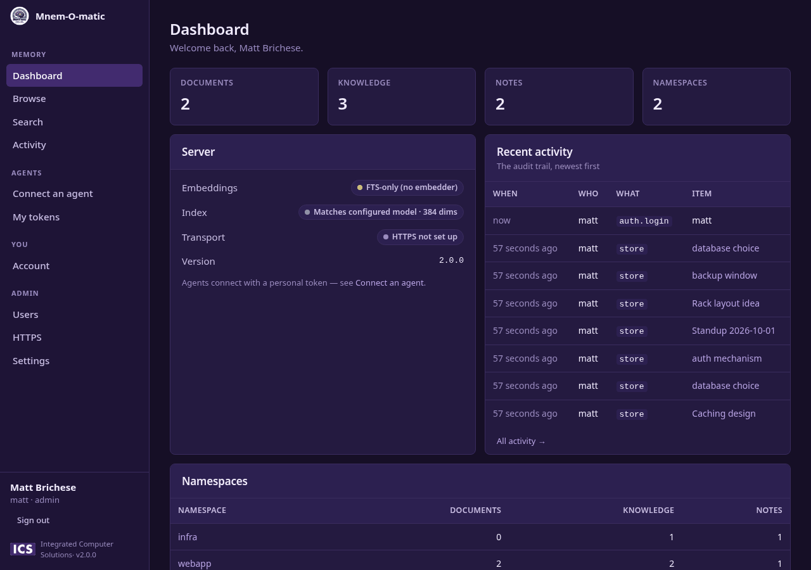</a><br><sub>Dashboard</sub></td>
<td align="center"><a href="../assets/mnemomatic-ui-browse.png">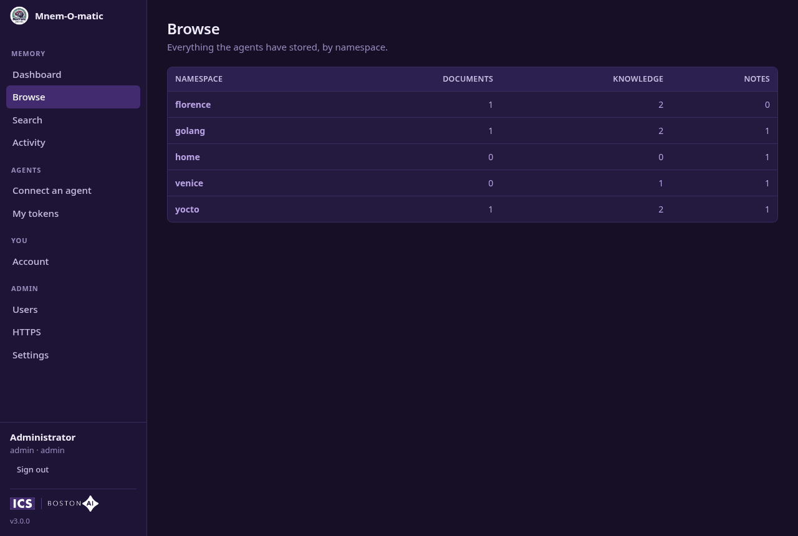</a><br><sub>Browse: namespaces</sub></td>
<td align="center"><a href="../assets/mnemomatic-ui-browse-items.png">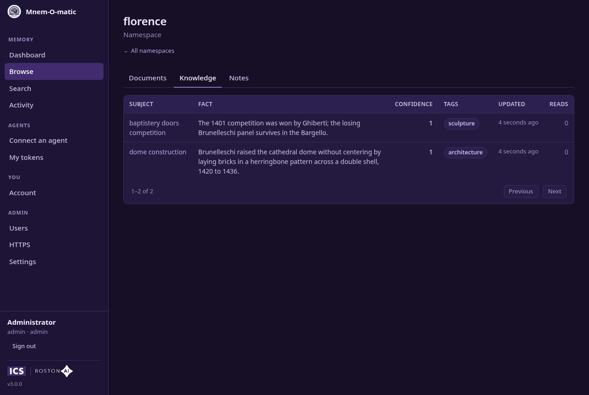</a><br><sub>Browse: items in a namespace</sub></td>
</tr>
<tr>
<td align="center"><a href="../assets/mnemomatic-ui-item.png">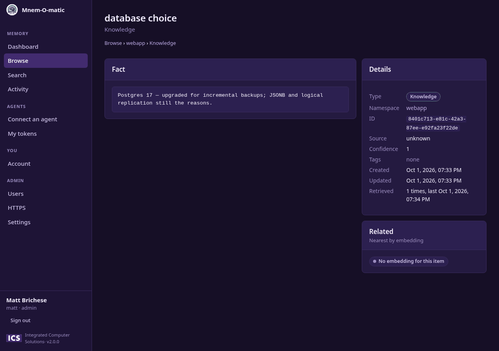</a><br><sub>Item detail with revisions and related items</sub></td>
<td align="center"><a href="../assets/mnemomatic-ui-search.png">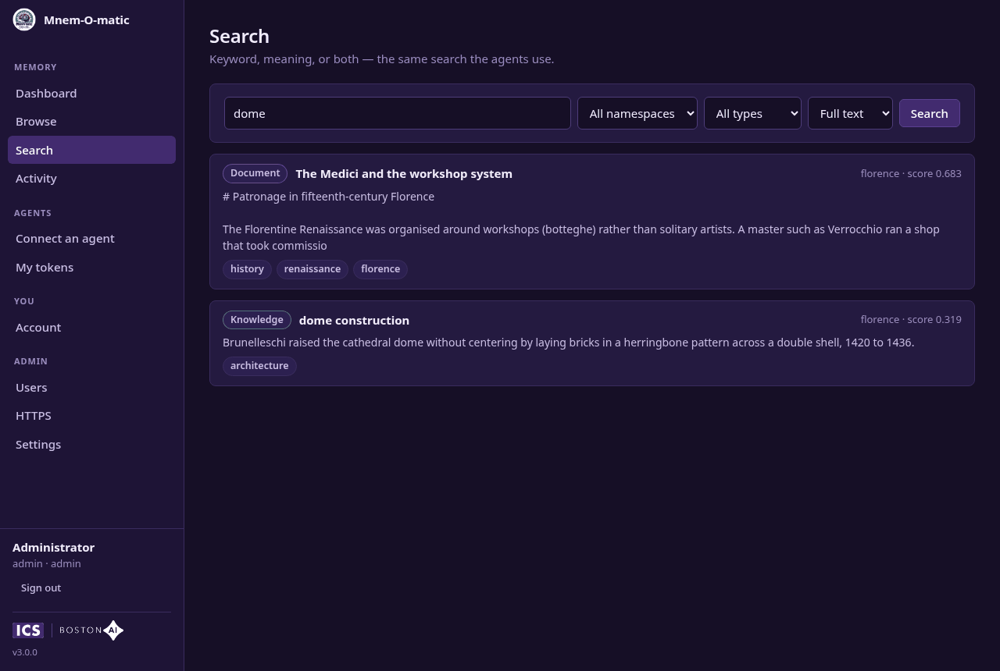</a><br><sub>Search</sub></td>
<td align="center"><a href="../assets/mnemomatic-ui-activity.png">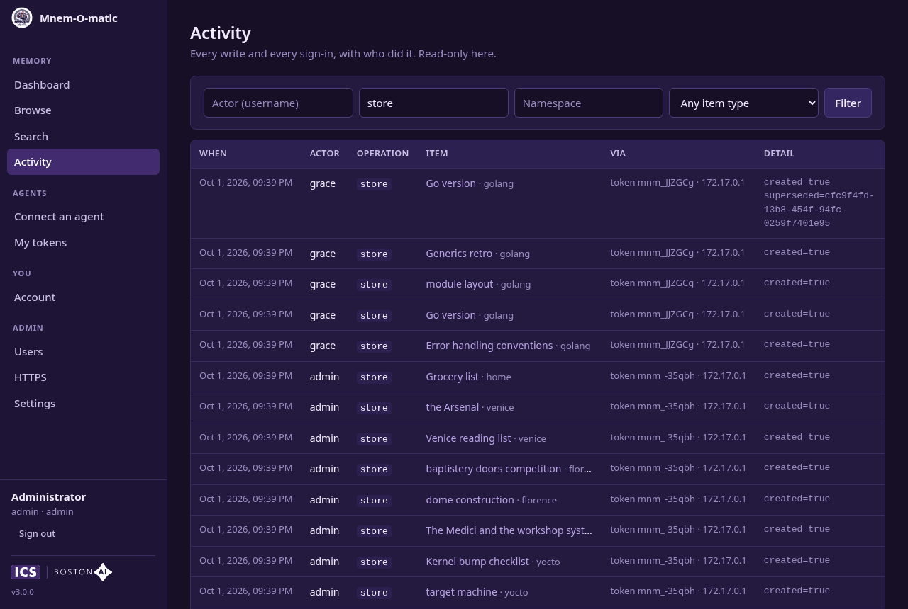</a><br><sub>Activity</sub></td>
</tr>
<tr>
<td align="center"><a href="../assets/mnemomatic-ui-connect.png">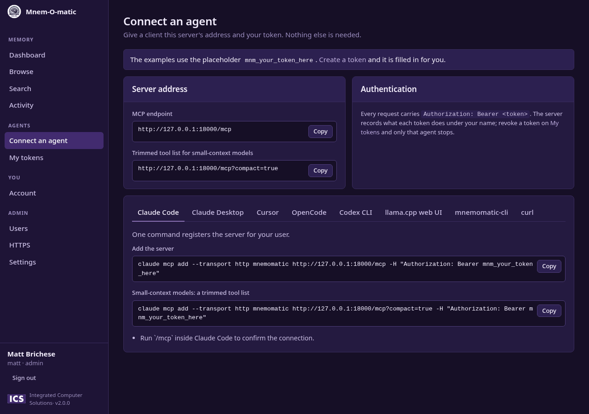</a><br><sub>Connect an agent</sub></td>
<td align="center"><a href="../assets/mnemomatic-ui-tokens.png">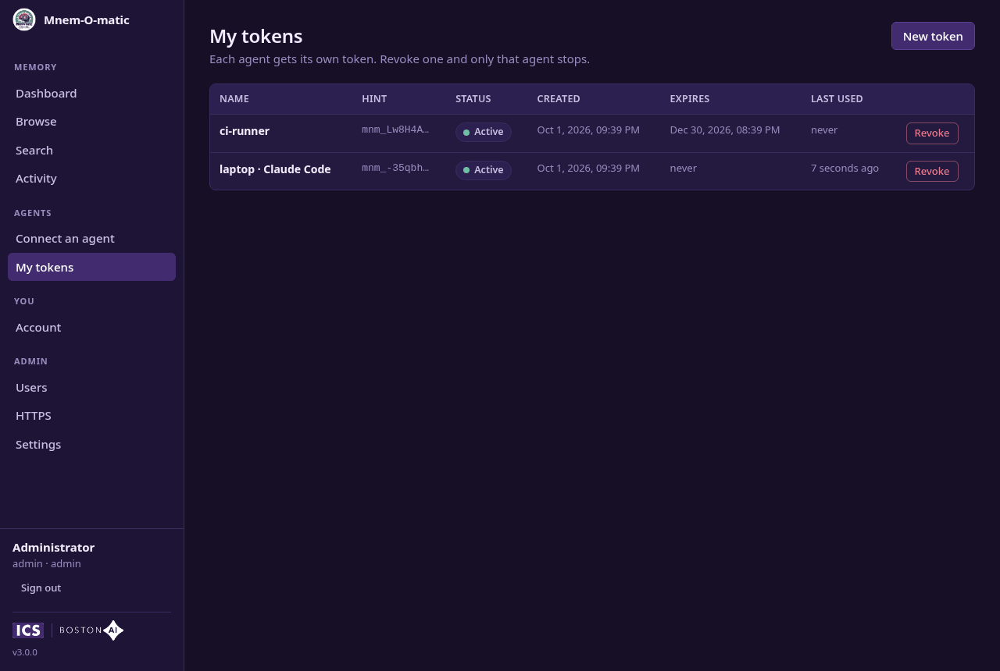</a><br><sub>My tokens</sub></td>
<td align="center"><a href="../assets/mnemomatic-ui-users.png">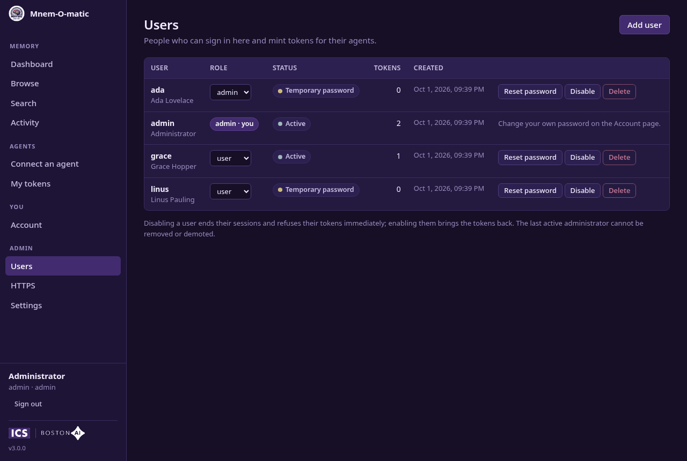</a><br><sub>Users (admin)</sub></td>
</tr>
<tr>
<td align="center"><a href="../assets/mnemomatic-ui-https.png">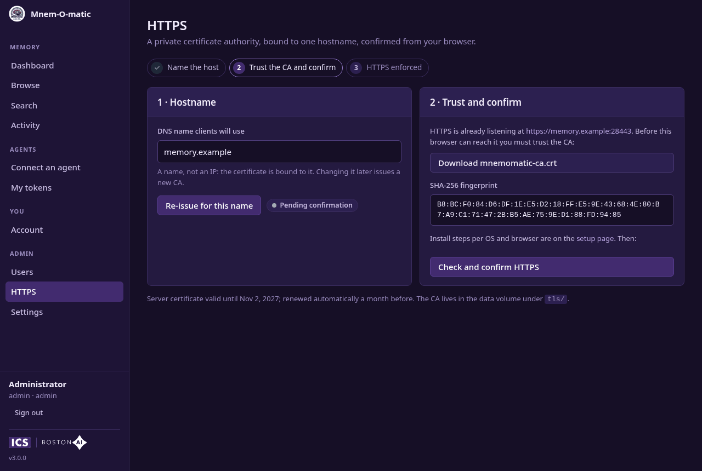</a><br><sub>HTTPS (admin)</sub></td>
<td align="center"><a href="../assets/mnemomatic-ui-settings.png">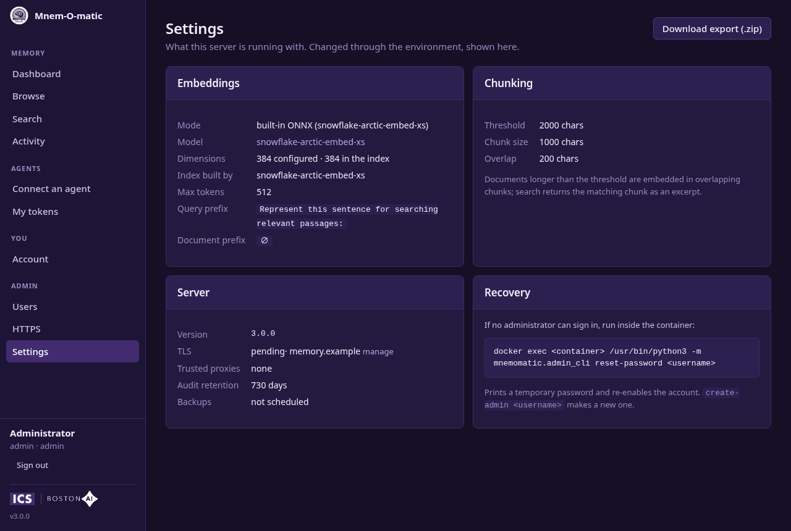</a><br><sub>Settings (admin)</sub></td>
<td align="center"><a href="../assets/mnemomatic-ui-login.png">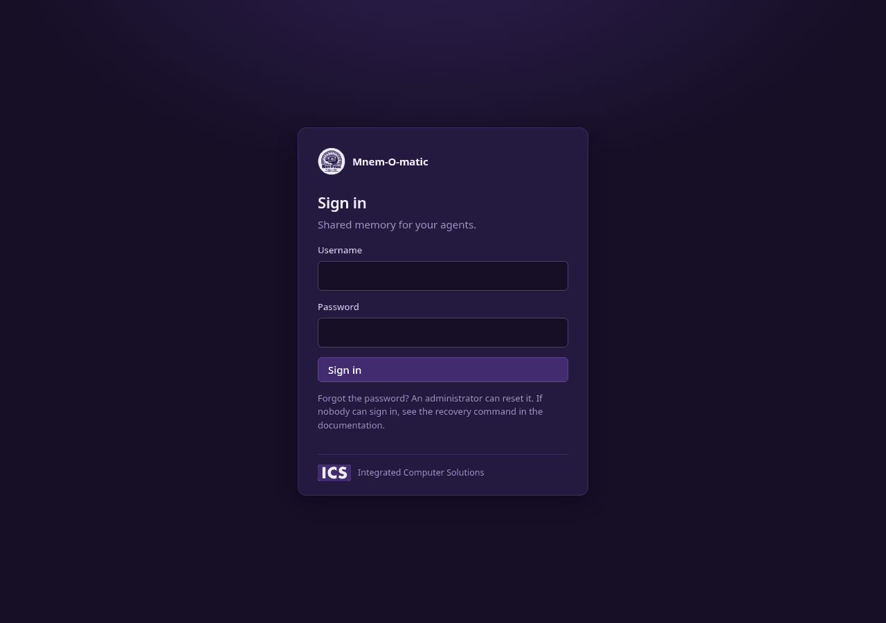</a><br><sub>Sign in</sub></td>
</tr>
</table>
<sub><i>Click any image to view full size.</i></sub>
</div>

Security notes:
- Every page carries `Content-Security-Policy` (scripts and connections from this origin only, no inline scripts), `X-Content-Type-Options: nosniff` and `Referrer-Policy: no-referrer`; HTTPS responses add `Strict-Transport-Security`.
- State-changing requests must come from the site itself: the API checks that the request's `Origin` matches its `Host`, and the session cookie is `SameSite=Strict`. That is the cross-site request forgery defence.
- The UI is a Svelte application built into the image; the server serves it with hashed, immutable assets and never caches `index.html`. Clients that do not ask for HTML — an MCP client probing `/.well-known/…` after a 401 — get a JSON 404, not a page.

## Export

`GET /export` downloads the entire store (or one namespace with `?namespace=...`) as a **human-readable zip archive** — for backups, or for porting content into another system:

```
mnemomatic-export-2026-08-02.zip
├── export-info.json          # manifest: format version, server version and build, date, counts, namespace map
└── <namespace>/
    ├── documents/
    │   ├── <title>.md        # the document content, byte-faithful — nothing injected
    │   └── metadata.json     # filename → exact title, id, tags, timestamps, metadata
    ├── knowledge/            # one .md per entry containing the fact
    └── notes/
```

File names are sanitized titles (collisions get an id suffix); the exact originals are always in the `metadata.json` sidecars, and the manifest maps folder names back to exact namespace names. Document extensions follow the mime type (`.md`, `.txt`, `.json`). Embeddings, chunks, and full-text indexes are **not** exported — they are derived data, and excluding them keeps the archive independent of the embedding model. Superseded knowledge entries and item revisions are not exported either: the archive carries the store's current state.

Three ways to trigger it:

```bash
# curl (the endpoint honors the same Bearer auth as MCP)
curl -H "Authorization: Bearer $KEY" -OJ https://your-host/export

# CLI — writes atomically (never leaves a truncated zip over a previous backup)
mnemomatic-cli export -o /backups/          # directory: server-suggested, date-based name
mnemomatic-cli export -o memory.zip         # exact file path
mnemomatic-cli export -o -                  # raw zip to stdout, for piping
mnemomatic-cli export -n myproject          # single namespace

# Web viewer: Settings → Export → "Download export"
```

The date-based default filename means a daily cron job gets one file per day, and re-running the same day safely replaces that day's file (the CLI downloads to `<name>.part` and renames only on success).

### Scheduled backups

The server can also write the export archive itself, on a schedule — no cron or CLI on the host required. Point `MNEMOMATIC_BACKUP_DIR` at a directory (in Docker, somewhere under the mounted data volume):

```yaml
    environment:
      - MNEMOMATIC_BACKUP_DIR=/data/backups
      - MNEMOMATIC_BACKUP_INTERVAL=24   # hours between backups (default 24)
      - MNEMOMATIC_BACKUP_KEEP=7        # archives to retain (default 7)
```

Backups are full exports (all namespaces) named `mnemomatic-backup-YYYYMMDD-HHMMSS.zip` (UTC), written atomically. Once more than `MNEMOMATIC_BACKUP_KEEP` exist, the oldest are deleted — pruning only ever touches that filename pattern, so manual exports stored in the same directory are never removed. The schedule survives restarts: the next backup is due one interval after the newest existing archive, not after boot, so restarting the server neither skips a backup nor churns the retention window. When `MNEMOMATIC_BACKUP_DIR` is unset, nothing runs.

The CLI + cron path above remains the right choice when the backup needs to leave the machine or be encrypted (e.g. piping `export -o -` through `gpg`).

## Usage Tracking & Revisions

Two always-on recording mechanisms make the store safer to mutate and lay the groundwork for memory-review workflows:

**Usage tracking** — every item carries a `retrieval_count` and `last_accessed`, bumped when the item is fetched with the `read` tool (or an MCP resource) and when a search surfaces it in results. Browsing does **not** count: `list_items`, the web UI, exports, and backups never touch the counters, so they measure genuine retrieval, not housekeeping. The counters appear in `read` output and `list_items` summaries; `updated_at` is never affected. There is no ranking impact yet — the data accumulates first, so any future ranking blend can be tuned against real numbers.

**Revisions** — every update and delete first saves the item's prior state, including upsert overwrites (`store_*` on an existing title/subject), tag edits, `delete_namespace`, and items replaced by a `rename_namespace` merge. The server keeps the newest `MNEMOMATIC_REVISIONS_KEEP` revisions per item (default 10; `0` disables capture). Two tools work with them:

```
list_revisions [item_type] [item_id] [namespace] [limit]   # newest first; op is "update" or "delete"
restore <revision_id>                                       # roll back / undelete
```

`restore` semantics:
- If the item still exists, its content rolls back to the revision's state through the normal update path — the pre-restore state is captured as a new revision first, so **a restore can itself be undone**.
- If the item was deleted, it is recreated with its original id and `created_at`. When another item has since taken the same namespace + title/subject, the restore refuses (naming the occupant) instead of overwriting it.
- Restored content is re-embedded immediately, so search reflects it right away.

Revisions store content and metadata, not embeddings — like the export archive, they stay independent of the embedding model. Note that deleting an item does **not** purge its revisions: recovering exactly that data is what they are for. Set `MNEMOMATIC_REVISIONS_KEEP=0` if items must be gone the moment they are deleted.

## Audit Log

Every successful write operation is recorded in an **append-only audit log** — the event trail that complements revisions: revisions hold what an item *was* (for restore, pruned per item), the audit log holds what *happened* (for accountability, never pruned).

Each event carries the timestamp, operation (`store`, `update`, `supersede`, `delete`, `tag`, `restore`, `rename_namespace`, `delete_namespace`, plus the identity events below), the item's type/id/namespace/title, op-specific detail (e.g. which fields an update touched, which entry a supersession closed), and the request's identity:

| Field | Source | Trust |
|-------|--------|-------|
| `actor` | The authenticated username — the owner of the token or session that made the request. For a user a [trusted proxy](installation.md#behind-an-identity-aware-proxy) introduced, the identity the proxy sent (an email address, usually), whichever way they arrived | Authenticated |
| `detail.token` | The token's name, id and hint (`mnm_` + 6 characters), when the request came through a token — the Activity page shows the name | Authenticated; stays meaningful after the token is revoked |
| `detail.label` | The client's `X-Mnemomatic-Actor` header, if it sends one — a sub-identity within one person's tokens ("laptop", "ci") | Self-declared |
| `client` | The `User-Agent` header | What the connecting software reports |
| `ip` | The connection's peer address, or the forwarded client address when the peer is a trusted proxy | Behind a reverse proxy this is the proxy's own address unless `MNEMOMATIC_TRUSTED_PROXIES` names it |

Identity operations are audited too, with the acting user as `actor` and the affected user or token as the item: `auth.login`, `auth.login_failed` (with the reason), `auth.logout`, `password.changed`, `password.reset`, `user.created`, `user.deactivated`, `user.reactivated`, `user.role_changed`, `user.deleted`, `token.created`, `token.revoked`, `https.changed`, `admin.created`, `export`, and `schema.migrated` when the database moved to a new schema version. Events written before 3.0 keep whatever self-declared actor they had.

The user, token and HTTPS events — which carry other people's addresses and the names tried at sign-in — are shown only to administrators, on the Activity page and through `list_audit`. A sign-in name that could not be a real username is not recorded, and attempts refused by the throttle are not logged one by one. Long header values (user agent, `X-Mnemomatic-Actor`) are truncated.

To label a client within your own tokens, add the header to its MCP configuration:

```bash
claude mcp add --transport http mnemomatic https://your-host:8443/mcp \
  -H "Authorization: Bearer mnm_your_token" \
  -H "X-Mnemomatic-Actor: laptop"
```

Query the trail with the `list_audit` tool — filter by item, namespace, or operation:

```
list_audit(namespace="myproject")                  # recent activity in a project
list_audit(item_id="abc-123")                      # everything that happened to one item
list_audit(op="delete")                            # all deletions, store-wide
```

Reads are deliberately not audited (usage tracking covers retrieval); failed content operations are not recorded; and a failing audit write never breaks the operation it describes. The trail is also browsable in the web UI under **Activity**.

Retention is time-based: events older than `MNEMOMATIC_AUDIT_KEEP_DAYS` (default 730 — two years) are pruned as new ones are appended; set `0` to keep the trail forever. Events are a couple of hundred bytes each (titles and ids, never content), so even the default retention stays in the low tens of MB on a busy store.

## Temporal Facts

Knowledge entries answer questions like "what is our auth method?" — and the answer changes over time. So knowledge is **temporal**: when a fact changes, the old entry is *superseded* rather than overwritten. It stays in the store with `valid_until` (when it stopped being the current answer) and `superseded_by` (the id of its replacement), answering "what did we believe before, and until when?"

How a fact changes:
- `store_knowledge` with an existing subject and a **different** fact → the current entry is closed, the new fact becomes a new entry, and the response carries `"superseded": "<old-id>"`. Re-storing the **same** fact just refreshes the entry in place (no history spam from agents re-storing what they know).
- `update_knowledge` changing `fact` → same supersession; changing only `confidence`/`source`/`tags`/`metadata` edits the current entry in place (captured as a revision, like documents and notes).

Superseded entries are **excluded from search, listings, counts, and exports** — only the current answer surfaces. They remain readable by id and through the dedicated tool:

```
fact_history(namespace="webapp", subject="auth method")
→ {"count": 3, "history": [ current entry, then superseded versions newest first ]}
```

History is immutable: updating a superseded entry returns an error (correct the current fact instead). Deleting one is allowed (pruning history). Deleting the *current* entry ends the chain — the next `store_knowledge` for that subject starts a fresh one, and `fact_history` still shows everything ever held for the subject.

The division of labor with [revisions](#usage-tracking--revisions): fact changes are *history* (first-class, queryable, permanent); everything else — in-place edits, deletes, document/note changes — is *undo* (revisions, capped per item).

## Memory Hygiene: Duplicates, Consolidation, Prompts

Mnem-O-matic never needs its own LLM for memory upkeep — every MCP client already is one. The server does the mechanical part (vector math, usage statistics) and hands the judgment to the connected agent:

**`similar` on store responses** — when newly stored content is nearly identical (cosine ≥ `MNEMOMATIC_SIMILAR_THRESHOLD`, default 0.8) to items already in the namespace, the store response includes a `similar` list (id, title, score). The agent that is mid-write is the best judge: merge, supersede, or ignore. Requires an embedder; chunked documents (no whole-document vector) are skipped; `0` disables the check.

**`consolidation_report` tool** — mechanical consolidation candidates for a namespace: same-type near-duplicate clusters computed from the stored vectors, plus stale items (never retrieved since usage tracking began and not updated in `stale_days` days, default 90). Pure vector math and SQL — the report only *flags*. Clustering needs numpy, which the full image includes; the lite image returns the stale list and says duplicate detection is unavailable. The comparison runs off the request loop, so a large namespace does not stall the server.

**Prompts** — two MCP prompts turn the report into workflows (in Claude Code they appear as slash commands):

- `consolidate(namespace)` — walks the agent through the report: read every cluster member, merge duplicates (fold unique details in, delete the copy — recoverable via revisions), let conflicting facts supersede through `update_knowledge`, review stale items (keep / tag `deprecated` / delete), and report actions taken. Conservative by instruction: nothing is deleted unread.
- `briefing(task, [namespace])` — memory that shows up prepared: the agent derives several search queries from a task description, reads what's relevant, checks `fact_history` where an answer may have changed, and answers with a briefing (constraints, references, gaps) instead of a search log.

For scheduled upkeep, run the consolidation from cron via a headless agent — it uses your existing subscription, no API keys:

```
claude -p "Use the mnemomatic consolidate prompt on namespace 'myproject' and apply its workflow."
```

A note on early reports: usage counters only accumulate from the moment this feature is deployed, so "never retrieved" on a fresh upgrade means "not retrieved *yet*" — give the data a few weeks before trusting the stale list.

## CLI Interface

`mnemomatic-cli` provides shell access to a running Mnem-O-matic server for agents and users without MCP support.

### Installation

```bash
git clone https://github.com/integratedcomputersolutions/mnem-o-matic.git
cd mnem-o-matic
uv tool install ./cli
```

This installs `mnemomatic-cli` into an isolated environment with no extra dependencies. Verify with:

```bash
mnemomatic-cli --help
```

To uninstall: `uv tool uninstall mnemomatic-cli`

For development (runs from source without installing):

```bash
uv run --project cli mnemomatic-cli --help
```

### Configuration

Settings resolve with this priority: **CLI flags > environment variables > config file > defaults**.

| Setting | CLI flag | Environment variable | Config key | Default |
|---------|----------|---------------------|------------|---------|
| Server URL | `--server-url` | `MNEMOMATIC_SERVER_URL` | `server.url` | `http://localhost:8000` |
| Token | `--token` | `MNEMOMATIC_TOKEN` | `server.token` | *(none)* |
| CA certificate | `--ca-cert` | `MNEMOMATIC_CA_CERT` | `server.ca_cert` | *(system trust store)* |
| Search mode | `-m` / `--mode` | `MNEMOMATIC_SEARCH_MODE` | `search.mode` | `hybrid` |

The config file lives at `~/.config/mnemomatic/config.toml`:

```toml
[server]
url = "https://your-server-hostname"
token = "mnm_your_token"
# ca_cert = "/home/you/mnemomatic-ca.crt"   # when the server uses its built-in CA

[search]
mode = "fulltext"
```

> **Security:** Prefer the environment variable or config file for the token — CLI flags are visible in the process list. The CLI warns if the config file is readable by other users.

### Commands

```bash
# Search
mnemomatic-cli search "authentication"
mnemomatic-cli search "JWT tokens" -n webapp -m semantic -l 5
mnemomatic-cli search "deploy" --tag runbook --updated-after 2026-08-01

# Store
mnemomatic-cli store document myproject "API spec" "Full API specification text"
mnemomatic-cli store knowledge myproject "auth method" "Uses JWT with RS256"
mnemomatic-cli store note myproject "Quick thought" "Consider adding rate limiting"

# Read from stdin (use '-' as content)
cat spec.md | mnemomatic-cli store document myproject "API spec" -

# Update
mnemomatic-cli update document <id> --content "Updated content"
mnemomatic-cli update knowledge <id> --fact "Migrated to session cookies"

# Delete individual items
mnemomatic-cli delete document <id>
mnemomatic-cli delete knowledge <id>
mnemomatic-cli delete note <id>

# Read full content by ID (after a search)
mnemomatic-cli read document <id>
mnemomatic-cli read knowledge <id>
mnemomatic-cli read note <id>

# Get full content by ID (via resource URI)
mnemomatic-cli get document <id>

# Tags
mnemomatic-cli tag <id> document --add prod --add critical --remove draft

# Browse content in a namespace
mnemomatic-cli list documents myproject
mnemomatic-cli list knowledge myproject
mnemomatic-cli list notes myproject

# Paginated listing for large namespaces (uses the list_items tool)
mnemomatic-cli list documents myproject --limit 20
mnemomatic-cli list documents myproject --limit 20 --offset 20

# Namespace management
mnemomatic-cli namespace list
mnemomatic-cli namespace rename old-project new-project
mnemomatic-cli namespace delete old-project           # prompts for confirmation
mnemomatic-cli namespace delete old-project --yes     # skip prompt (scripts/agents)

# Export (see the Export section)
mnemomatic-cli export -o /backups/                    # all namespaces, into a directory
mnemomatic-cli export -n myproject -o project.zip     # one namespace, exact filename
mnemomatic-cli export -o - | gpg -e -r me@example.com > backup.zip.gpg   # stream to stdout
```

All output is JSON. Use `--pretty` for indented output:

```bash
mnemomatic-cli --pretty search "auth"
```

## Available Tools

Once connected, your LLM has access to these tools:

| Tool                 | Description                                          |
| -------------------- | ---------------------------------------------------- |
| `store_document`     | Save a document (code, spec, config)                 |
| `store_knowledge`    | Save a fact, decision, or observation                |
| `store_note`         | Save a quick thought, idea, or transcript            |
| `update_document`    | Modify an existing document                          |
| `update_knowledge`   | Modify an existing knowledge entry                   |
| `update_note`        | Modify an existing note                              |
| `delete_document`    | Remove a document                                    |
| `delete_knowledge`   | Remove a knowledge entry                             |
| `delete_note`        | Remove a note                                        |
| `tag`                | Add or remove tags on any entry                      |
| `search`             | Search across all stored data; optional `tags` / `updated_after` filters (see Search Filters) |
| `related`            | Items most similar to an existing item — "more like this" (see Related Items) |
| `read`               | Fetch full content of an item by ID                  |
| `list_items`         | List item summaries in a namespace, newest first, paginated with `limit`/`offset` (response includes `total`) |
| `rename_namespace`   | Rename a namespace atomically across all item types. Merges into an existing target: on title/subject collisions the moved item replaces the target's (upsert semantics); the response reports `replaced` counts. |
| `delete_namespace`   | Permanently delete all items in a namespace          |
| `list_revisions`     | List saved prior versions of items (captured on every update and delete), newest first — filter by type, item, or namespace |
| `restore`            | Restore an item to a revision: roll back an update or recreate a deleted item |
| `fact_history`       | The timeline of a knowledge fact: the current entry, then every superseded version (see Temporal Facts) |
| `consolidation_report` | Consolidation candidates for a namespace: near-duplicate clusters and stale never-retrieved items (see Memory Hygiene) |
| `list_audit`         | The append-only audit trail of write operations, newest first — filter by item, namespace, or operation (see Audit Log) |
| `embedding_info`     | Which embedding model is in use, whether it matches the one that built the index, and whether semantic search is available (see Embedding Info) |

### Input Validation & Limits

Mnem-O-matic validates all inputs to prevent silent failures:

| Constraint | Limit | Impact |
|-----------|-------|--------|
| **Namespace length** | ≤ 100 chars | Used for grouping related entries |
| **Content length** | ≤ 100,000 chars | Documents, notes, facts |
| **Title length** | ≤ 500 chars | Document/note titles, knowledge subjects |
| **Search query** | Non-empty, ≤ 10,000 chars | Empty queries rejected; very long queries capped |
| **Search results** | ≤ 100 results | Limited to prevent memory exhaustion; use smaller limits for faster results |
| **Tags per entry** | ≤ 100 tags | Too many tags degrade performance |
| **Tag length** | ≤ 50 chars each | Keep tags short and descriptive |
| **Metadata keys** | ≤ 50 keys | Avoid excessive metadata |
| **Metadata value** | ≤ 10,000 chars | Keep values reasonably sized |
| **Confidence (knowledge)** | 0.0 to 1.0 | Must be a valid probability |
| **Embedding dimension** | Must match embedder | Mismatch causes search errors; server warns at startup |
| **Request body** | ≤ 4 MB | Applies to every HTTP request; larger bodies are refused with `413` before anything reads them. Sized so a store call at all the limits above fits several times over — it is not configurable |

If validation fails, tools return an error with details — fix the input and retry.

### Deduplication

Store tools use upsert semantics — if an entry with the same namespace and title (for documents) or namespace and subject (for knowledge) already exists, it is updated rather than creating a duplicate.

This matters because LLMs don't track what's already stored. Without deduplication, restarting a session and re-storing the same facts would create duplicate rows. Documents and notes update in place (`"created": false`). Knowledge is temporal (see [Temporal Facts](#temporal-facts)): re-storing the *same* fact refreshes the entry in place, while storing a *different* fact for an existing subject supersedes it — the old entry is kept as queryable history:

```
# First call — creates a new entry
store_knowledge(namespace="webapp", subject="auth method", fact="Uses JWT with RS256")
→ {"id": "abc-123", "created": true}

# Same fact again — refreshes in place, no history entry
store_knowledge(namespace="webapp", subject="auth method", fact="Uses JWT with RS256")
→ {"id": "abc-123", "created": false}

# The fact changed — the old entry is closed and kept as history
store_knowledge(namespace="webapp", subject="auth method", fact="Migrated to session cookies")
→ {"id": "def-456", "created": true, "superseded": "abc-123"}
```

### Chunked Retrieval for Large Documents

Documents longer than `MNEMOMATIC_CHUNK_THRESHOLD` (default: 2000 chars) are automatically split into overlapping chunks at store time. Each chunk gets its own vector embedding, so semantic search returns the most relevant passage rather than a whole-document match.

When a search result comes from a chunk, the response includes `"partial": true`. This signals that only part of the document was returned — call `read` with the same `id` to retrieve the full content.

```
# Search returns a relevant passage from a large document
search("authentication flow")
→ {"id": "abc-123", "title": "API spec", "snippet": "...JWT tokens are validated by...", "partial": true}

# Fetch the full document when needed
read(item_type="document", id="abc-123")
→ {"content": "...full document..."}
```

Chunking is transparent: documents are split and indexed automatically, and search results use the same `id` as the parent document. Small documents, knowledge entries, and notes are unaffected.

Existing documents stored before upgrading continue to work via their whole-document embeddings. They transition to chunk-based retrieval automatically the next time they are stored or updated.

| Env var | Default | Description |
|---------|---------|-------------|
| `MNEMOMATIC_CHUNK_THRESHOLD` | `2000` | Document length in chars above which chunking is applied |
| `MNEMOMATIC_CHUNK_SIZE` | `1000` | Target chunk size in chars |
| `MNEMOMATIC_CHUNK_OVERLAP` | `200` | Overlap between consecutive chunks in chars |

### Search Modes

The `search` tool supports three modes:

- **fulltext** — keyword and phrase matching via SQLite FTS5
- **semantic** — meaning-based search via vector embeddings
- **hybrid** (default) — combines both, ranked by a blended score

### Search Filters

Two optional filters narrow any mode, and compose with `namespace` and `content_type`:

- **`tags`** — only items carrying **all** the listed tags (exact matches, not prefixes)
- **`updated_after`** — only items updated at or after an ISO date or datetime (`"2026-08-01"`, `"2026-08-01T12:00:00"`)

```
search("deployment", tags=["runbook"])                     # tagged runbooks only
search("auth", updated_after="2026-08-01")                  # what changed recently
search("cache", tags=["decision"], updated_after="2026-07-01", namespace="webapp")
```

Filtering never changes the ranking — results still come back by relevance, and only qualifying items are considered. From the CLI:

```bash
mnemomatic-cli search "deployment" --tag runbook --tag current
mnemomatic-cli search "auth" --updated-after 2026-08-01
```

### Related Items

`related(item_type, id)` returns the items most similar to one you already have — "more like this", without composing a query:

```
related(item_type="document", id="abc-123")            # neighbors across all types
related(item_type="knowledge", id="def-456", namespace="webapp", limit=10)
```

Results span all content types, ranked by embedding similarity, and never include the item itself. It needs an embedder (semantic search); chunked documents work through the centroid of their chunk vectors. Items stored while no embedder was configured have no vector and return an error suggesting a `MNEMOMATIC_REINDEX=1` restart.

### Embedding Info

`embedding_info()` reports the state semantic search depends on:

```json
{
  "semantic_search": true,
  "mode": "built-in ONNX (amaretto-embed-148m)",
  "model": "amaretto-embed-148m",
  "dimensions": 768,
  "index_model": "amaretto-embed-148m",
  "index_dimensions": 768,
  "matches_index": true,
  "query_prefix": "task: search result | query: ",
  "doc_prefix": "title: none | text: ",
  "max_tokens": 2048,
  "model_url": "https://huggingface.co/AmarettoLabs/amaretto-embed-148m"
}
```

The field worth checking is **`matches_index`**. Search only works when the model embedding your query is the one that embedded the stored content — query a model against another model's vectors and results come back plausible but wrong, with no error to notice. `false` means the index needs rebuilding (see [Switching Embedding Models](installation.md#switching-embedding-models)) and similarity scores mean little until it is.

`null` means unknowable rather than mismatched: the database was written before the server began recording which model built the index. `semantic_search: false` means no embedder is available at all — `semantic` mode will error and `hybrid` falls back to fulltext.

External endpoints report `endpoint` and `wire_api` in place of `max_tokens`.

### Example Usage

After connecting Claude Code, you can interact naturally:

> "Store a knowledge entry in the 'webapp' namespace: the API uses JWT with RS256 signing for authentication"

> "Search for anything related to authentication"

> "Store this deployment config as a document in the 'infra' namespace"

> "What do you know about the database setup?"

## HTTP Endpoints

Alongside the MCP transport, the server exposes these plain HTTP routes:

| Route | Auth | Purpose |
| ----- | ---- | ------- |
| `GET /health` | **none** | Liveness — `{"status": "ok"}`. Used by the images' `HEALTHCHECK`; see [Health Endpoint](installation.md#health-endpoint) |
| `GET /export` | token or session | The full store as a zip; optional `?namespace=` filter (see [Export](#export)). Audited |
| `GET /ca.crt` | **none** | The built-in certificate authority, when one is configured |
| `GET /setup` | **none** | How to trust the CA and move to HTTPS |
| `/api/…` | session | The web UI's JSON API — sign-in, tokens, users, HTTPS, read-only views of the store |
| `/` and anything else | **none** | The web UI |

Every request is capped at a 4 MB body (1 MiB under `/api`); anything larger gets `413` without being read (see [Input Validation & Limits](#input-validation--limits)).

All of them are served on both the plain port (8000) and, once set up, the HTTPS port (8443). After HTTPS is confirmed the plain port keeps only `/health`, `/setup`, `/ca.crt` and the instance id; `/mcp`, `/api` and `/export` answer `403 https_required` there, and the rest redirects to `/setup`.

## Available Resources

MCP resources provide read-only access to browse stored data:

| Resource URI                         | Description                    |
| ------------------------------------ | ------------------------------ |
| `mnemomatic://namespaces`            | List all namespaces            |
| `mnemomatic://documents/{namespace}` | List documents in a namespace  |
| `mnemomatic://knowledge/{namespace}` | List knowledge in a namespace  |
| `mnemomatic://notes/{namespace}`     | List notes in a namespace      |
| `mnemomatic://document/{id}`         | Get a specific document        |
| `mnemomatic://knowledge-entry/{id}`  | Get a specific knowledge entry |
| `mnemomatic://note/{id}`             | Get a specific note            |
